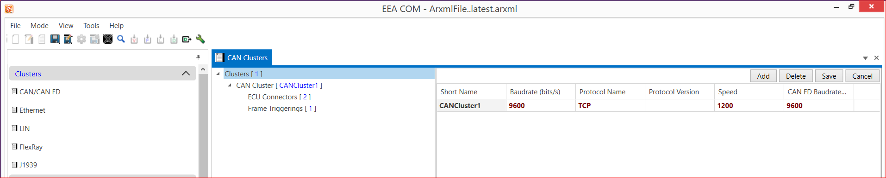
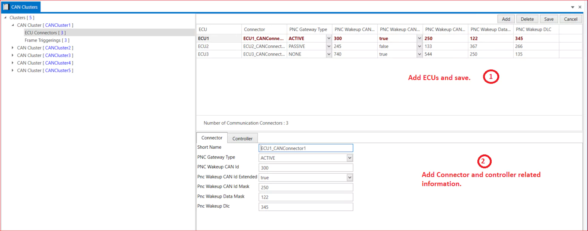
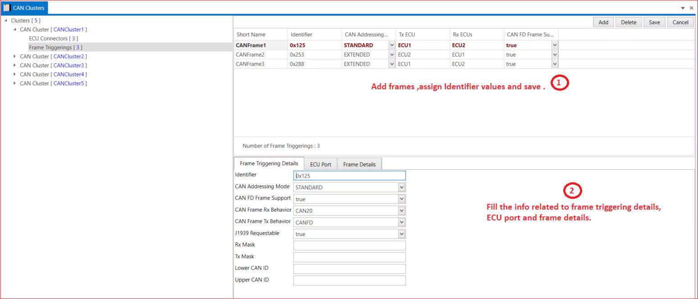

# 2.1 CAN/CAN FD Cluster

To view the CAN Cluster information, select CAN, and EEA COM will display all the related details as shown in the screenshot below. EEA COM provides the ability to add, edit, and delete cluster information in AUTOSAR ARXML files.

<figure>

<figcaption>Fig. CAN/CAN FD Cluster</figcaption>
</figure>

We can add multiple clusters and assign values to the following parameters: short name, Baud Rate (bits/s), protocol names (e.g., TCP and UDP), speed, and CAN FD Baud Rate (bits/s).

## 2.1.1  ECU Connectors {#ecu-connectors}

We can add ECUs and fill in the information related to them. There are two parts: the connector and the controller. Please select the PNC Gateway Type (Active, Passive, or None).

<figure>

<figcaption>Fig. ECU Connectors</figcaption>
</figure>

## 2.1.2 Frame Triggerings {#frame-triggerings} 

Add CAN frames and select CAN frames. For frame triggering details, assign the identifier in hexadecimal format (for example, 0x164). Choose the CAN frames that meet the specified requirements. In the ECU ports, select both Tx and Rx ECUs. Ensure that all information related to the frame is available in the Frame Details section. 

<figure>

<figcaption>Fig. Frame Triggering in CAN Cluster</figcaption>
</figure>

