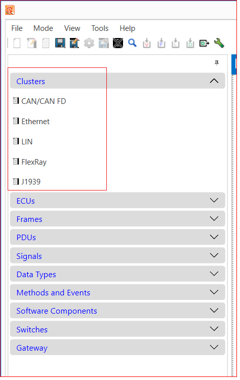

# Clusters

The "Cluster" tab on EEA COM displays various cluster information. The Clusters tab shows information for the following clusters.

1. CAN Cluster
2. Ethernet Cluster
3. LIN
4. FlexRay
5. J1939 

<figure>

<figcaption>Fig. Cluster Types</figcaption>
</figure>

To view information for each cluster, click on the specific cluster, and detailed information will open in the window on the right.

