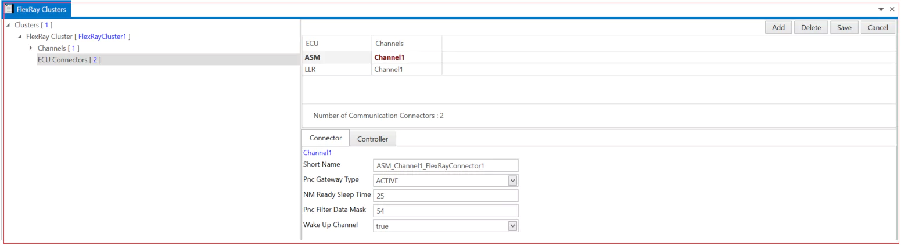

# 2.4 FlexRay Cluster

FlexRay Cluster A system consists of a set of nodes that concurrently execute a distributed real-time application. The nodes communicate by sending and receiving messages over a dedicated communication channel. The nodes and the communication channel form a cluster.

1. Add FlexRay Cluster→ Short Name → Baudrate(bits/s) → Protocol Name→ Protocol Version → Speed –> Save.

## 2.4.1 Channels {#channels}

1. Add channel1 and channel2→ Channel Name (Channel A and B) → Save.

2. Add Frame Triggering →  Select FlexRay Frame → Message ID → Tx ECU → Rx ECU → Save.

3. Frame Triggering Details → Message ID → Allow Dynamic L SDU Length (True or false) → Payload Preamble Indicator (True or False) → Add Scheduling Timing → Communication Cycle Type (Counter or Repetition) → Slot ID → Cycle Counter→Base Cycle → Cycle Repetition → Save.

4. ECU PORT → Add Tx ECU → Rx ECU  → Save

5. All the information of the frame is available in the Frame Details Section.

6. Add ECU Connector → Select ECU → Channel →Connector and Controller Fill the details →  Save it.

<figure>

<figcaption>Fig. FlexRay Cluster</figcaption>
</figure>

 