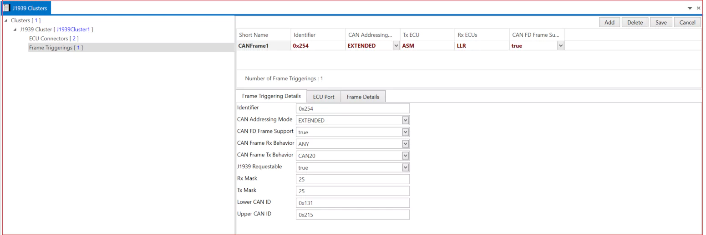

# 2.5 J1939  Cluster

J1939 is a set of standards that define how ECUs communicate via the CAN bus in heavy-duty vehicles. 

1. Add cluster→  Short Name →Baudrate(Bits/s) → Protocol version → Protocol Name → Speed → CAN FD Baudrate(Bits/s) → Network ID(1 to 4) → Request 2 Support(True or False) → Uses Address Arbitration(True or False) → Save.

## 2.5.1 ECU Connectors {#j1939-cluster-ecu-connectors}

1. Add ECU → Connector → PNC Gateway Type → PNC Wakeup CAN Id → PNC Wakeup CAN Id Extended → PNC Wakeup CAN Id Mask → PNC Wakeup DLC →Save.
2. ECU Controller  Fill the CAN Configuration Requirements → CAN FD Configuration Requirements  →CAN FD Configuration → Save.

## 2.5.2 Frame Triggerings {#j1939-cluster-frame-triggerings}

1. Add and Select CAN Frame→ Short Name→Identifier → CAN Addressing Mode → Tx ECU → Rx ECUs → CAN FD Frame Support → Save. ECU port → Select Tx and Rx ECUs. All CAN Frame details available in Frame detail section.

<figure>

<figcaption>Fig. J1939 Cluster</figcaption>
</figure>

 