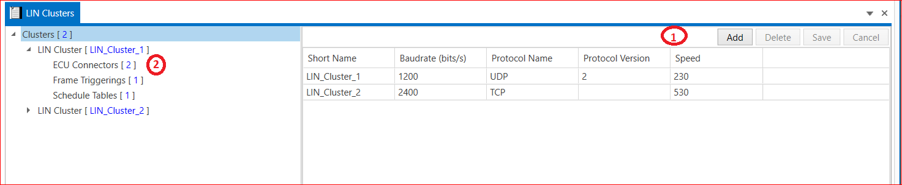
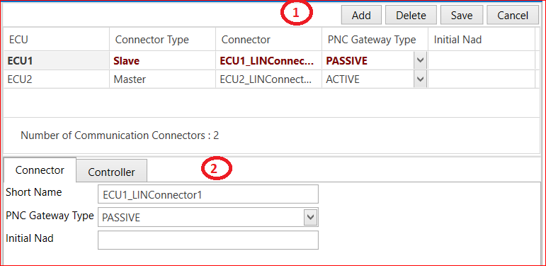
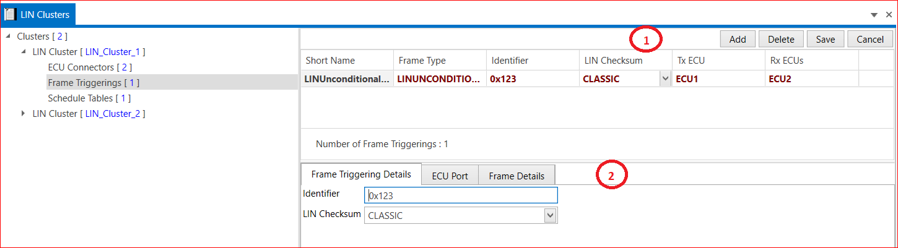
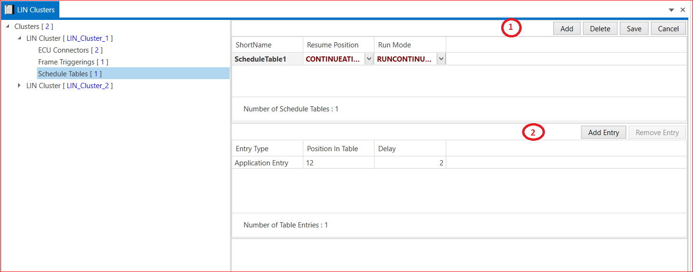

# 2.3 LIN Cluster

A LIN cluster is defined as a number of LIN nodes connected through a physical cable. LIN clusters consist of 1 master and up to 16 slave nodes.The LIN bus connects a single master device (ECU/node) and one or more slave devices (ECU/nodes) together in a LIN cluster. All Signals in a LIN Cluster are defined in the LIN Description File(LDF).

1. Add LIN cluster→ Short Name → Baudrate(Bits/s) → Protocol Name → Protocol Version → Speed → Save.

2. LIN Cluster sub points ECU connector, Frame Triggerings and Schedule Table.

<figure>

<figcaption>Fig. LIN Cluster</figcaption>
</figure>

## 2.3.1 ECU Connector {#ecu-connector}

1. Add ECU → Connector Type (Master or slave) → Connector → PNC Gateway Type(Active,None and Passive)→ Initial Nad → Save.

2. Connector and controller two parts are there. Controller part Controller Type → Wakeup By Controller Supported (True or false) → Protocol version –> Configured Nad –> Function Id → Supplier Id → variant Id → Save.

<figure>

<figcaption>Fig. ECU Connector in LIN Cluster</figcaption>
</figure>

## 2.3.2 Frame Triggering {#frame-triggering} 

1. Add Frame or select Frames (LIN Sporadic Frames, LIN Unconditional Frames and LIN Event Triggered Frames) → Short Name → Frame Type → Identifier → LIN Checksum(Classic and Enhanced) → Tx ECU → Rx ECU →Save.

2. Frame Triggering Details → ECU Port(Here we select Tx and Rx ECUs) → Frame Details available.

<figure>

<figcaption>Fig. Frame Triggering in  LIN Cluster</figcaption>
</figure>

 

## 2.3.3 Schedule Tables {#schedule-tables}

1. Add schedule table → Short Name → Resume Position→ Run mode→ Save. Add Entry→ Select LIN Frame Triggering→ Enter Type→ Position in Table→ Delay → Save.

<figure>

<figcaption>Fig. Schedule Table in LIN Cluster</figcaption>
</figure>

 