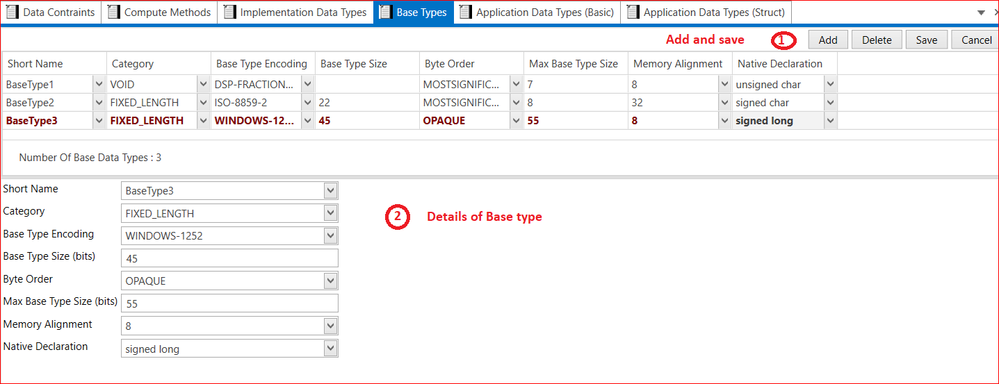

# 7.4  Base Type

Add Base Type→ Short Name → Category(VOID, FIXED_LENGTH) →  Base Type Encoding→ Base Type Size(bits) → Byte Order (MOSTSIGNIFICANTBYTEFIRST, MOSTSIGNIFICANTBYTELAST, OPAQUE)→ Max Base Type Size(bits)→ Memory Alignment (0,8 and 32)→ Native Declaration (Signed Short , Unsigned Short , Signed Long, Unsigned Long,  Signed Char , Unsigned Char, Float and double)→ Save.

<figure>

<figcaption>Fig. Base Type</figcaption>
</figure>

