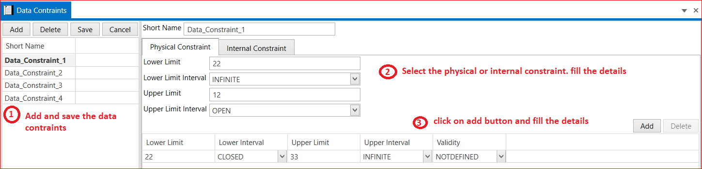

# 7.1 Data Constraints

A Data Constraint is used to decorate other data types with one or more constraints. Use the dataConstraintRef property of the Application DataType or Implementation DataType classes to access the reference string.

1. Add Data Constraints → Short Name → In Physical Constraint  → Lower and Upper Limit → Lower and Upper Limit Interval→ Validity(NOTAVAILABLE, NOT DEFINED, NOT VALID, VALID)→ Save Physical Constraints.

2. Add Internal Constraints → Short Name  → Lower and Upper Limit→ Lower and Upper Limit Interval → Validity(NOTAVAILABLE, NOT DEFINED, NOT VALID, VALID) → Save Internal Constraints.

<figure>

<figcaption>Fig. Data Constraints</figcaption>
</figure>

