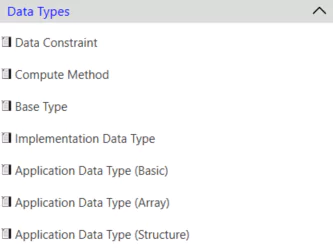

# Data Types

The Data Type tab on EEA COM displays various data type information. We can create and edit data types from this section.

<figure>

<figcaption>Fig. Data Types</figcaption>
</figure>

To view and edit the information for each data type, click on the specific data type, and the detailed information tab will open in the window to the right.
