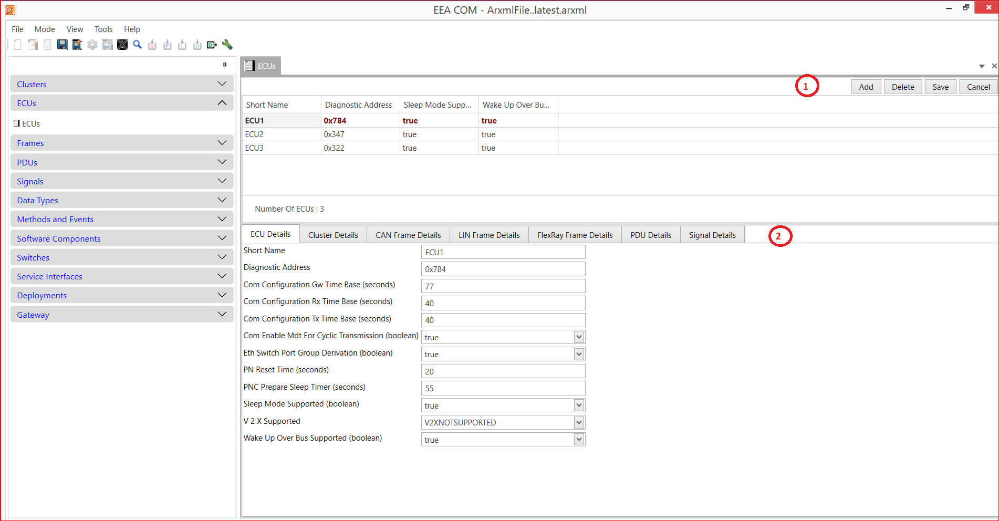

# ECU

1. Add ECU → Short Name → Diagnostic Address (Hexadecimal value) → Sleep Mode Supported(boolean)(True or false) → Wake UP Over Bus Supported(Boolean) (True or False) → Save.
2. Cluster Details → CAN Frame Details → LIN Frame Details → FlexRay Frame Details → PDU Details →Signals Details → all the parameters details are available because we selected ECU in multiple sections.

<figure>

<figcaption>Fig. ECUs</figcaption>
</figure>

 

