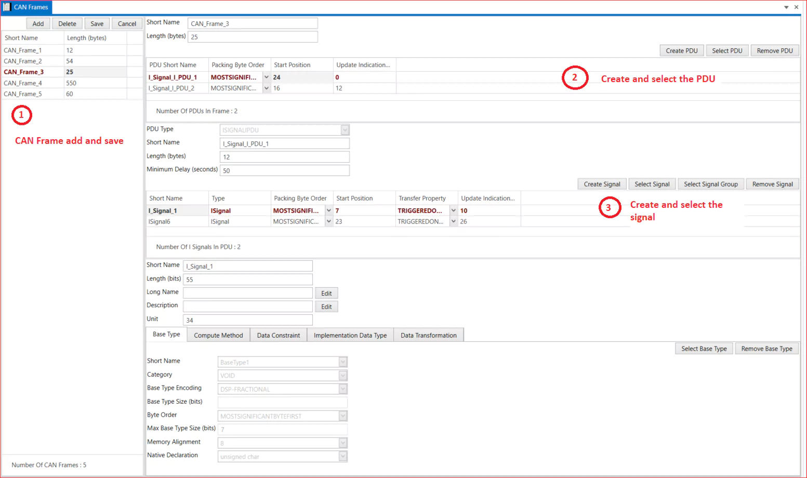

# 4.1 CAN Frames

1. Add CAN Frame → Short Name → Length(Bytes) → Save.
2. Create PDU →Select PDU Type → Short Name → Packing Byte Order → Start Position → Update Indication Bit Position → Save.
3. Create or Select Signal → Short Name →Type → Transfer Property →  Packing Byte Order → Start Position → Update Indication Bit Position→ Length(bits) → Select Any one (Base Type /Compute Method/Data Constraint/Implementation Data Type/Data transformation ) → Save.

<figure>

<figcaption>Fig. CAN Frame</figcaption>
</figure>

 