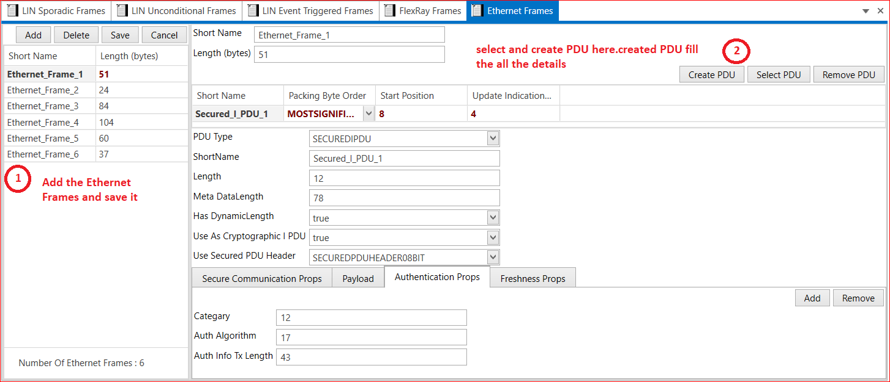

# 4.6 Ethernet Frames

An Ethernet frame starts with a header, which contains the source and destination MAC addresses, among other data. The middle part of the frame is the actual data. The frame ends with a field called Frame Check Sequence (FCS).

1. Add Ethernet Frame → Short Name → Length(bytes)→ Save.
2. Create PDU or Select PDU →  Select  PDU Type → Short Name →Packing Byte Order (MOST SIGNIFICANT BIT FIRST, MOST SIGNIFICANT BYTE LAST and OPAQUE)→ Start Position → Update Indication → Save.

<figure>

<figcaption>Fig. Ethernet Frames</figcaption>
</figure>

 
