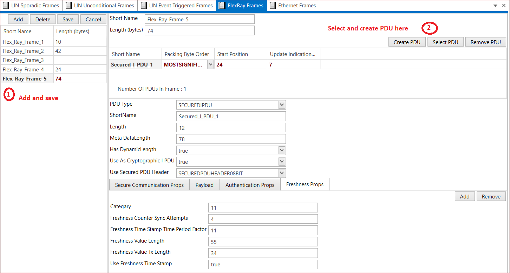

# 4.5 FlexRay Frames

FlexRay is a communication bus designed to ensure high data rates, fault tolerance, operating on a time cycle, split into static and dynamic segments for event-triggered and time-triggered communications.

1. Add FlexRay Frame→ Short Name → Length(bytes)→  Save
2. Create PDU or Select PDU →  Select  PDU Type –> Short Name –> Packing Byte Order (MOST SIGNIFICANT BIT FIRST, MOST SIGNIFICANT BYTE LAST and OPAQUE)--> Start Position –> Update Indication –> Save.  

<figure>

<figcaption>Fig. FlexRay Frame</figcaption>
</figure>

 

