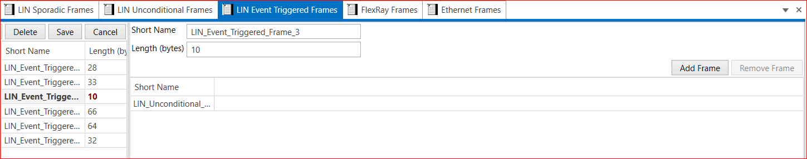

# 4.4 LIN Event Triggered Frames

The purpose of this method is to receive as much information from the slave nodes without overloading the bus with frames. 

An event triggered frame can be filled with the data from more than one slave node. A slave only updates the data in an event-triggered frame when the value has changed. If more than one slave wants to update data in the frame a collision occurs. 

The master should then send the frames to each of the slaves starting with the one with the highest priority.
In the below figure add the frames and assign a short name to the frame. Add and select the LIN Unconditional frame and save frame.

1. Add LIN Event Triggered Frames→ Short Name → Length(Bytes) → Save.
2. Add Frame → Select Frame → LIN Unconditional Frame → Save.(Remove Frame option is also available)

<figure>

<figcaption>Fig. LIN Event Triggered Frame</figcaption>
</figure>

 