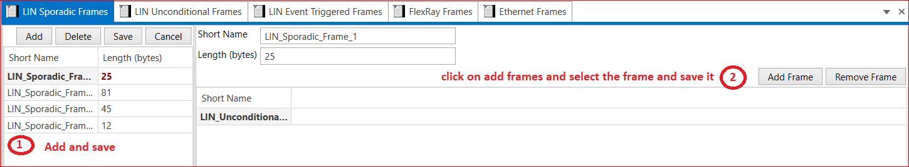

# 4.2 LIN Sporadic Frames
Sporadic frames attempt to provide some dynamic behavior to LIN. Sporadic frames always carry signals (data), and their IDs. Only the slave task associated with the master node can send sporadic frames.

In the figure below, you can add frames, giving each frame a short name and assigning a Length (in bytes) value. Options to add or remove frames are available. After selecting the frame, ensure to save your changes.

<figure>

<figcaption>Fig. LIN Sporadic Frame</figcaption>
</figure>

 
