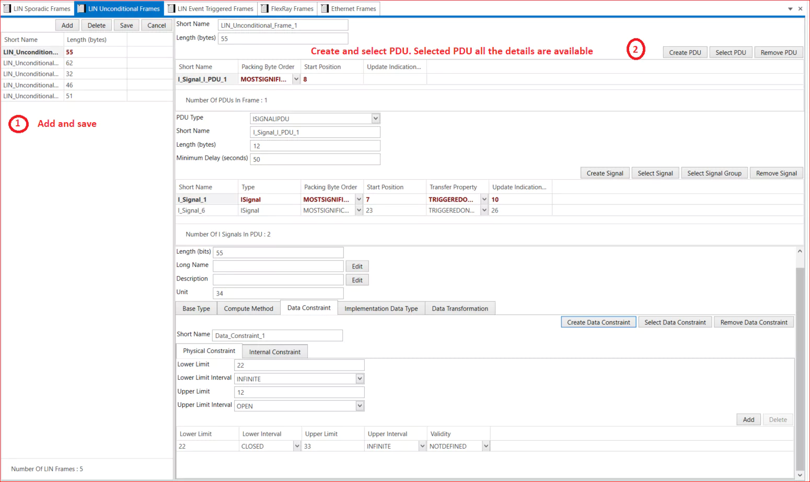

# 4.3 LIN Unconditional Frames

This frame is the normal type of LIN message format for data communication. Basically, the master node will send this frame header in a scheduled frame slot and the designated slave node will receive and fill the data and send it back. 

This frame normally carries off the signals and the defined identifiers from 0-59 (0x00 to 0x3B).
In the LIN Unconditional frames, assign a short name and a value to the length (in bytes).

The options for creating a PDU and selecting a PDU are available. When selecting the PDU option, choose the PDU Type and frame. Additionally, select the Packing Byte Order options, provide a value for the start position, and update the indication bit position.

1. Add LIN Unconditional Frames→ Short Name → Length (bytes) → Save 
2. Create PDU or Select PDU →  Select PDU → Type → All the details of PDU are displayed →  Short Name → Packing Byte order → Start Position → Update Indication → Save. 

<figure>

<figcaption>Fig. LIN Unconditional Frame</figcaption>
</figure>

 