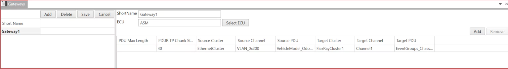

# Gateway

A gateway is a function within an EcuInstance that performs as a FrameMapping, IPduMapping or ISignalMapping function between two or more CommunicationClusters.

1. Add Number of Gateways → Short Name → Select ECU→ Save Number of Gateways.

2. Add → Select PDU Mapping→ PDU Max Length → PDUR TP Chunk Size →Select Source Cluster → Select Source Channel →Select Source PDU→ Select Target Cluster→ Select Target Channel → Select Target PDU → Save Number of Contained | PDUs.

<figure>

<figcaption>Fig. Gateway</figcaption>
</figure>

