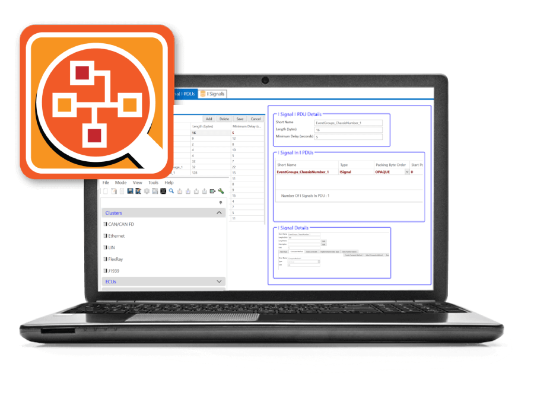

# Welcome to the EEA COM documentation

This documentation was created to help EEA COM users at every level of experience.

<figure>

<figcaption>Software to Design AUTOSAR Based ECUs Communication Matrix</figcaption>
</figure>

## Contents:

<!-- ## **[(1) Introduction and Overview](/introduction-and-overview/)** -->

<!-- 
 

### [(1) Introduction](/sp/)
### [(2) #](/test/)
### [(3) #](/test/)
### [(4) #](/test/)
### [(5) #](/test/)

 -->

## 1. [Introduction](/intro/)
- 1.1 [Features](/intro/#features)
- 1.2 [EEA Com UI](/intro/#eea-com-ui)
- 1.3 [Application Areas](/intro/#application-areas)
- 1.4 [File Menu](/intro/#file-menu)
- 1.5 [Tool Menu](/intro/#tool-menu)
- 1.6 [Panels](/intro/#panels)
- 1.7 [Modification Buttons](/intro/#modification-buttons)

## 2. [Cluster](/clusters/)
- 2.1 [CAN/CAN FD Cluster](/clusters/can-cluster/)
- 2.2 [Ethernet Cluster](/clusters/ethernet-cluster/)
- 2.3 [LIN Cluster](/clusters/lin-cluster/)
- 2.4 [FlexRay Cluster](/clusters/flexray-cluster/)
- 2.5 [J1939 Cluster](/clusters/j1939-cluster/)

## 3. [ECU](/ecu/)
 

## 4. [Frames](/frames/)
- 4.1 [CAN Frames](/frames/can-frames/)
- 4.2 [LIN Sporadic Frames](/frames/lin-sporadic-frames/)
- 4.3 [LIN Unconditional Frames](/frames/lin-unconditional-frames/)
- 4.4 [LIN Event Triggered Frames](/frames/lin-event-triggered-frames/)
- 4.5 [FlexRay Frames](/frames/flexray-frames/)
- 4.6 [Ethernet Frames](/frames/ethernet-frames/)

## 5. [PDUs (Protocol Data Units)](/pdus/)
- 5.1 [I Signal I PDUs](pdus/signal-pdus/)
- 5.2 [DCM I PDUs](/pdus/dcm-pdus/)
- 5.3 [Container I PDUs](/pdus/container-pdus/)
- 5.4 [General Purpose PDUs](/pdus/general-purpose-pdus/)
- 5.5 [J1939 DCM I PDUs](/pdus/j1939-dcm-pdus/)
- 5.6 [Multiplexed I PDUs](/pdus/multiplexed-pdus/)
- 5.7 [NM PDUs](/pdus/nm-pdus/)
- 5.8 [N PDUs](/pdus/n-pdus/)
- 5.9 [Secured I PDUs](/pdus/secured-pdus/)
- 5.10 [User Defined PDUs](/pdus/user-defined-pdus/)
- 5.11 [XCP PDUs](/pdus/xcp-pdus/)
- 5.12 [Secure Communication Props Set](/pdus/secure-communication-props-set/)

## 6. [Signals](/signal/)
- 6.1 [I Signals](/signal/signals/)
- 6.2 [I Signals Group](/signal/signals-group/)

## 7. [Data Types](/data-types/)
- 7.1 [Data Constraints](/data-types/data-constraints/)
- 7.2 [Application Data Type (Array)](/data-types/application-data-type/)
- 7.3 [Compute Method](/data-types/compute-method/)
- 7.4 [Base Type](/data-types/base-type/)
- 7.5 [Implementation Data Type](/data-types/implementation-data-types/)
- 7.6 [Application Data Type (Basic)](/data-types/application-data-type-basic/)
- 7.7 [Application Data Type (Structure)](/data-types/application-data-type-structure/)

## 8. [Methods and Events](/methods-and-events/)
- 8.1 [Methods](/methods-and-events/#methods)
- 8.2 [Events](/methods-and-events/#events)

## 9. [Software Components](/software-components/)
- 9.1 [Data Transformation Set](/software-components/data-transformation-set/)
- 9.2 [Application SW Component Type](/software-components/application-sw-component-type/)
- 9.3 [Composition SW Component Type](/software-components/composition-sw-component-type/)
- 9.4 [System](/software-components/system/)

## 10. [Switches](/switches/)
- 10.1 [Coupling Elements](/switches/#coupling-elements)

## 11. [Gateway](/gateway/)

