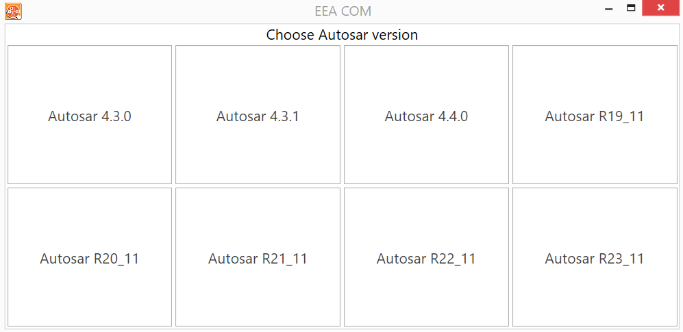

# Introduction

**EEA COM Expert - Tool to Edit, View and Create ARXML files for Network Databases.**

The EEA COM Expert software tool allows for communication networks design based on AUTOSAR.
The software enables users to view, edit and create AUTOSAR ARXML based network databases for
ECUs and support CAN/CAN FD, LIN, FlexRay and Automotive Ethernet. EEA COM imports and exports
ARXML format files for seamless interaction with other tools. It is designed to help legacy network
database users migrate to AUTOSAR based systems with ease.

In view mode, EEA COM loads an existing ARXML file for easy viewing of AUTOSAR Clusters
information, ECUs, PDUs and signal information with full details in hierarchical form. These multiple
simultaneous views give engineers an edge when it comes to understanding whole-network architecture.

## 1.1 Features {#features}

1. ARXML output files can be part of further AUTOSAR workflow or to load in other AUTOSAR tools. Edit to add new PDUs, frames, signals, data type and assign.
2. Create an entirely new AUTOSAR communication matrix by defining clusters, ECUs data types, and more.
3. Support for Ethernet and FlexRay communication architectures.
4. View or edit the Ethernet switch configuration from the ARXML file.
5. Edit and change LIN schedule table design.
6. Legacy and other database (`.dbc`, `.vsdb`, `.csv*`, `.ldf*`, `.fibex*`) import available.
7. ECU or System Extract can be loaded.
8. Edit compute methods and data types to test with real ECUs.
9. Support for creating Ethernet clusters for vehicle communication networks.
10. Support for SOME/IP – view Consumed and Provided Services. Edit Methods, Event, Event Groups, Others.
11. Easy View of Network Endpoints and Application End points. Easily change IP and Port configs for testing.
12. Easy view of Socket Connections – SoAd, DoIP entities. See details on Gateway ECUs.
13. EEA COM creates/loads an existing ARXML file for easy viewing/editing of AUTOSAR Clusters information, ECUs, PDUs, Frames, Methods and Events And signal information with full details in hierarchical form.

## 1.2 EEA Com UI {#eea-com-ui}

The window shown in the fig 1 will pop up after clicking on eeacom application icon. This window
provides options to work on different versions of autosar.

<figure>

<figcaption>Fig 1. eeacom startup window</figcaption>
</figure>

## 1.3 Application areas {#application-areas}

After selecting the desired AUTOSAR version, an application will pop up with all the options available
for working with that specific version of AUTOSAR.

<figure>

<figcaption>Fig 2. eeacom application</figcaption>
</figure>

## 1.4 File Menu {#file-menu}

All the menu options required to create or edit an ARXML file will appear after clicking on 'File,' as
shown in Figure 3

<figure>

<figcaption>Fig 3. File menu</figcaption>
</figure>

Explanations for each option in the file menu:
1. Create New - Create a new ARXML file from scratch.
2. Open to Edit - Load an existing ARXML file for editing.
3. Open to View - Load an existing ARXML file for viewing only; editing is not allowed.
4. Save - Save all changes made to the ARXML file.
5. Close File - Remove the currently loaded or created ARXML file, providing a clean start for the user.
6. Exit - Exit the application.

## 1.5 Tool Menu {#tool-menu}

All the export, import, and settings options will appear after clicking on the Tools menu.

<figure>

<figcaption>Fig 4. Tool Menu</figcaption>
</figure>

The explanation of all the options under the Tool menu is as follows.
1. Import VSDB - Imports a VSDB file and converts it into an ARXML file.
2. Import FIBEX - Imports a FIBEX file and converts it into an ARXML file.
3. Import LDF - Imports an LDF file and converts it into an ARXML file.
4. Import DBC - Imports a DBC file and converts it into an ARXML file.
5. Export DBC - Allows exporting a DBC file after loading the ARXML file in the application using the ‘Open to Edit’ option.
6. Export VSDB - Allows exporting a VSDB file after loading the ARXML file in the application using the ‘Open to Edit’ option.
7. Import Custom - Imports Excel data for SOMEIP and converts it into an ARXML file.
8. ARXML Comparison - Compares two ARXML files based on their CAN clusters and provides the output in an Excel sheet format.

## 1.6 Panels {#panels}

Refer to Figure 5 for an overview of all the areas of EEA COM.

<figure>

<figcaption>Fig 5. Panels</figcaption>
</figure>

1. Left Panel (1): Represents all the entities that can be created, edited, and viewed. It includes a button that opens the middle panel and displays the data in the most effective way.
2. Upper Middle Panel (2): Displays the details of the entities that the user clicks on in the left panel. These panels can be removed as needed and are detachable.
3. Bottom Middle Panel (3): Displays all activities occurring during the use of this application.
4. Top Right Panel (4): Displays a tree view of the ARXML file.
5. Middle Right Panel (5): Displays the attributes and their values for the selected entities in the tree panel.
6. Bottom Right Panel (6): Displays information or definitions of the attributes for the entity selected in the tree panel.

## 1.7 Modification Buttons {#modification-buttons}

The buttons shown in Figure 6 are displayed on the panels of all entities. These buttons are necessary while creating or editing an ARXML file. The 'Save' button saves all changes made to the selected entity in the panel. The 'Add' button adds a new entity, the 'Delete' button removes an entity, and the 'Cancel' button undoes any changes made to the entity.

<figure>

<figcaption>Fig 6. Modification buttons</figcaption>
</figure>

