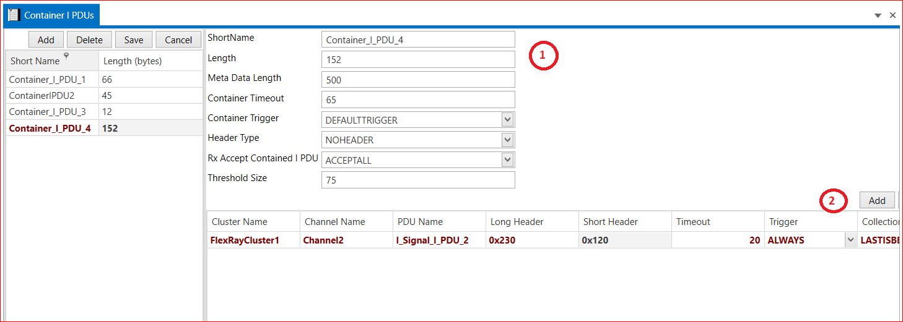

# 5.3 Container I PDUs

1. Add Container I PDU → Short Name → Length → Meta Data Length → Container Timeout → Container Trigger → Header Type → Rx Accept Contained I PDU → Threshold Size → Save.
   
2. Add → Select PDU→ Select Cluster →Select RxECUs → Select TxECUs →Select PDUs → Cluster Name → Channel Name → PDU Name → Long Header → Short Header → Timeout → Trigger(ALWAYS and NEVER)→Collection Semantics (LAST BEST and QUEUED) → Save.

<figure>

<figcaption>Fig. Container I PDUs</figcaption>
</figure>

