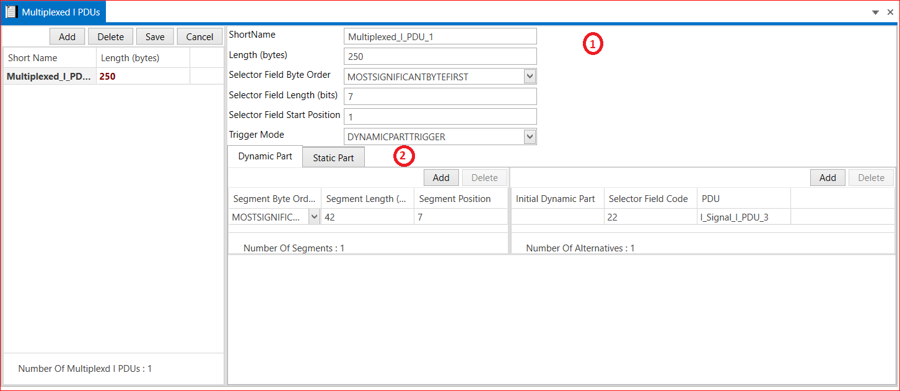

# 5.6 Multiplexed I PDUs

A Multiplexed I PDU contains a DynamicPart, an optional StaticPart and a selectorField. In case of multiplexing this I PDU is routed between the PDU Multiplexer and the Interface Layer.

A multiplexer is used to define variable parts within an I PDU that may carry different signals. The receivers of such a I PDU can determine which signal PDUs are transmitted by evaluating the selector field, which carries a unique selector code for each sub-part.

<figure>

<figcaption>Fig. Multiplexed I PDUs </figcaption>
</figure>

1. Add Multiplexed I PDU → Short Name → Length(bytes)→ Selector Field Byte Order( MOST SIGNIFICANT BIT FIRST, MOST SIGNIFICANT BYTE LAST and OPAQUE) →  Selector Field  Length(bits) →  Selector Field  start Position →Trigger Mode (DYNAMIC PART TRIGGER,STATIC OR DYNAMICPORT 
TRIGGER, STATIC PORT TRIGGER and NONE) → Dynamic part and Static Part.Dynamic Part  Number of Segment Byte Order( MOST SIGNIFICANT BIT FIRST, MOST SIGNIFICANT BYTE LAST and OPAQUE) →  Segment Length(bits) → Segment Position → Save.

2. Add Number of Alternative → Select I Signal I PDU →Initial Dynamic part → Selector Field Code -> PDU → Save. 

3. Static Part Number of Segment Byte Order( MOST SIGNIFICANT BIT FIRST, MOST SIGNIFICANT BYTE LAST and OPAQUE)→  Segment Length(bits) →Segment Position → Select PDU→ Select I Signal I PDU → Save.
