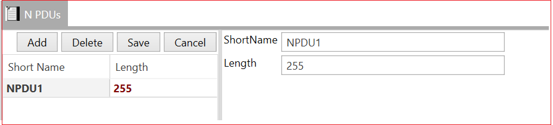

# 5.8 N PDUs

Whenever the PDU is in layers below PDUR and above Communication Drivers layer then its called N-PDU.

Add N PDU → Short Name→ Length→ Save.

<figure>

<figcaption>Fig. N PDUs </figcaption>
</figure>

