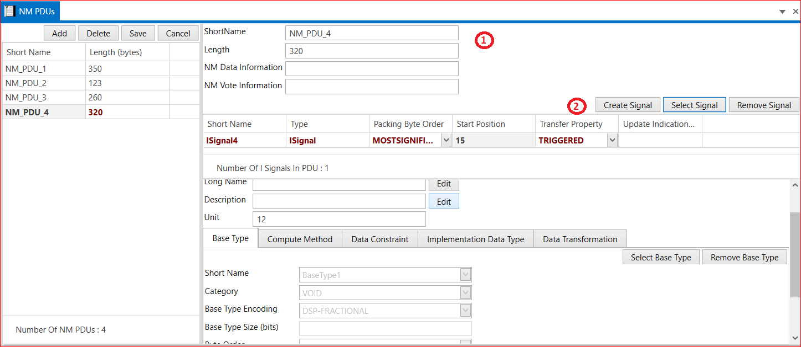

# 5.7 NM PDUs

1. Add NM PDU→ Short Name → Length→ NM Data Information → NM Vote Information → Save.
   
2. Create Signal Or Select Signal→ Select I  Signals → Short Name → Type→ Packing Byte Order → Start Position → Transfer Property → Update Indication →Save.

<figure>

<figcaption>Fig. NM PDUs </figcaption>
</figure>

