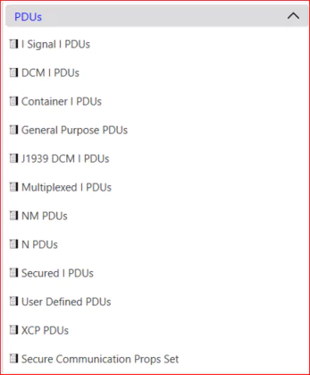
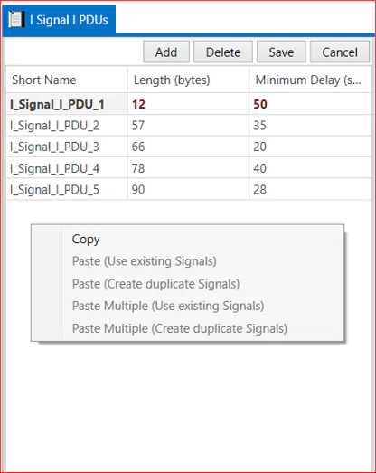

# PDUs (Protocol Data Units)

PDU contains information other than our data which is used or extracted by below or upper layers in transmission or reception respectively. The PDU is basically a group of packed signals along with lower layer information. AUTOSAR COM performs the packing or unpacking of signals in or from PDU while transmission or reception respectively. Every PDU has a unique identifier associated with it. 
               
The PDUs tab on EEA COM software shows multiple types of PDUs.

<figure>

<figcaption>Fig. PDUs Types</figcaption>
</figure>

 

Here is  one more thing: we can copy the PDU signals and paste. Also paste signals multiple times we can paste here  and also create the duplicate signals.

<figure>

<figcaption>Fig. PDUs copy paste option</figcaption>
</figure>

 