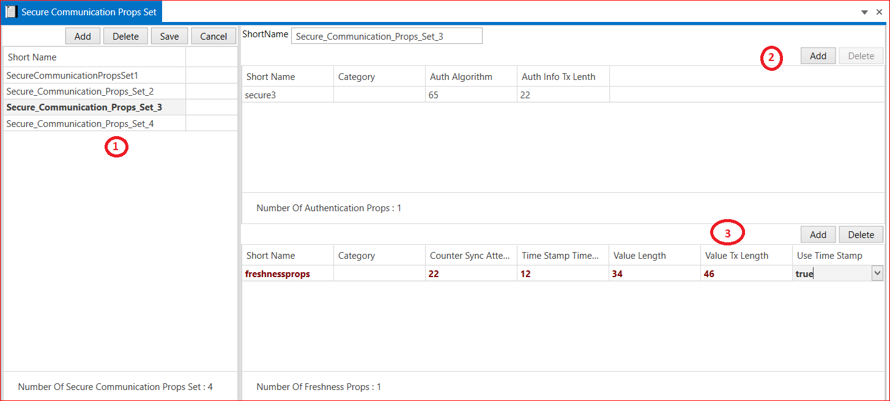

# 5.12 Secure Communication Props Set

1. Add Secure Communication Props Set → Short Name →Save.

2. Add Authentication Props→ Short Name → Category → Auth Algorithm → Auth Info Tx Length → Save.

3. Add Freshness Props → Short Name → Category → Counter Sync Attempts → Time Stamp Time Periodic Factor → Value Length → Value Tx Length → Use Time Stamp (True and False) →  Save

<figure>

<figcaption>Fig. Secure Communication Props Set PDUs</figcaption>
</figure>

