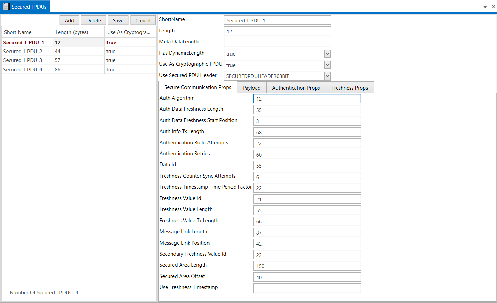
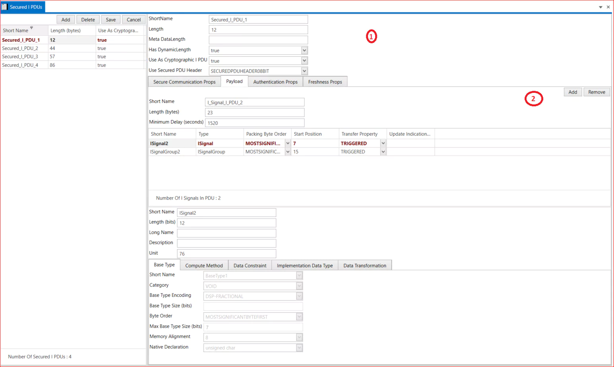
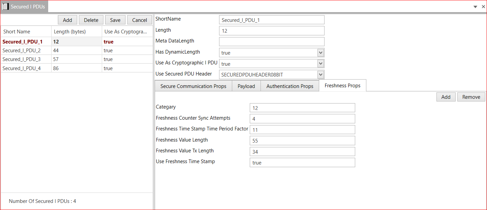

# 5.9 Secured I PDUs

1. Add  Secured I PDU→ Short Name → Length → Meta DataLength → Has Dynamic Length(True and False)→ Use As Cryptographic I PDU(True and False) → Use Secured PDU Header→ Save.

2. Secure Communication Props

3. Payload  
    Add Payload→ Select Payload → Select Cluster → Select Channel  → Select PDU→ Save.

4. Authentication Props  
    Add → Select Secure Authentication Props→ Category → Auth Algorithm → Auth Info Tx Length → Save.

5. Freshness Props  
    Add→ Select Secure Freshness Props→ Category → Freshness Counter Sync Attempts→ Freshness Time Stamp Time Period Factor→ Freshness Value Length → Freshness Value Tx Length → Use Freshness Timestamp → Save.

<figure>

<figcaption>Fig. Secured I PDUs</figcaption>
</figure>

 

<figure>

<figcaption>Payload in Secured I PDUs</figcaption>
</figure>

<figure>

<figcaption>Fig. Freshness Props In Secured I PDUs</figcaption>
</figure>

