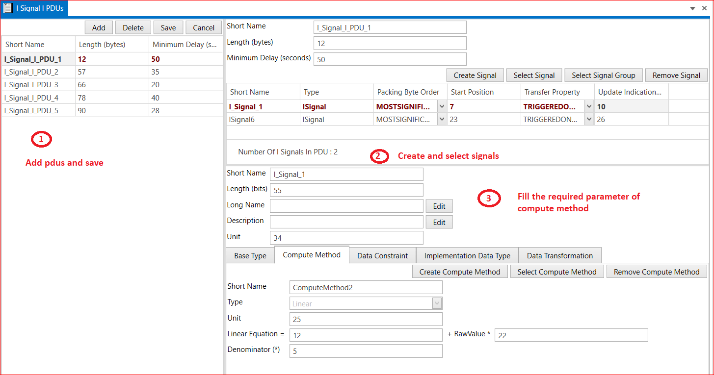

# 5.1 Signal I PDUs 

Steps to create I Signals I PDU is shown in below snap -

<figure>

<figcaption>Fig. Signal I PDUs</figcaption>
</figure>

 

1. Add I Signal I PDUs → Short Name → Length(Bytes) → Minimum Delay (seconds)  –>  Save.
2. Create Signal or Select Signal → Short Name → Length(bits) → Description→ Unit →Save.
3. Base Type,Compute Method, Data Constraint, Implementation Data Type and Data Transformation Select one and fill the data accordingly.

