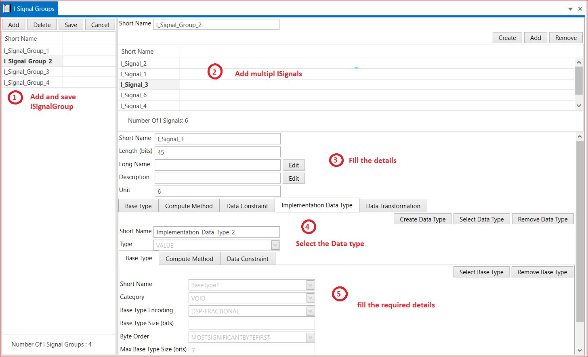

# 6.2 I Signals Group

A Signal Group is a set of signals to be transmitted at the same instance and the signals packed in a Signal Group are known as Group Signals.In the i signal group we create or select the more i signals.And also we add multiple ISignalGroups also.

<figure>

<figcaption>Fig. I Signals Group</figcaption>
</figure>

