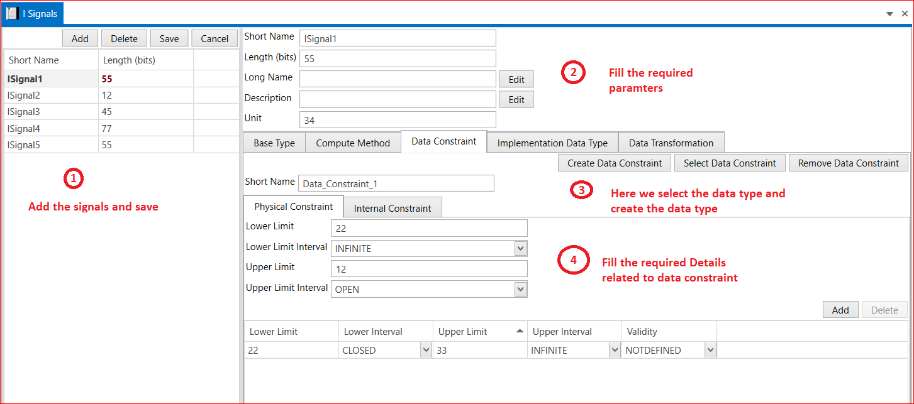

# 6.1 I Signals
In I Signals add the signals ,save and delete options are available.I Signals we can assign short name, length in bits, units and Long name.

Steps to create I Signals is shown in below snap -

<figure>

<figcaption>Fig. I Signals</figcaption>
</figure>

In signals we select or create the data types .
1. Base Type
2. Compute Method
3. Data constraint
4. Implementation Data Type
5. Data Transformation 
