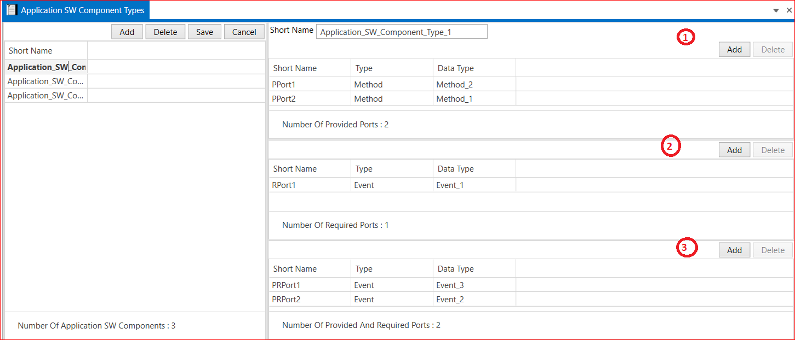

# 9.2 Application SW Component Type 
  
The application software component is an atomic software component that implements (a part of) an application. An atomic SW component cannot be decomposed into smaller units and can be assigned to only one ECU.

1. Add Application SW Component Type → Short Name→ Add Number of Provided Ports → Select Type (Methods and Events) → Save.
   
2. Add Number of Required Ports → Select Type (Methods and Events) → Save.

3. Add Number of Provided And Required Ports→ Select Type (Methods and Events) → Save it.

<figure>

<figcaption>Fig. Application SW Component Type</figcaption>
</figure>

