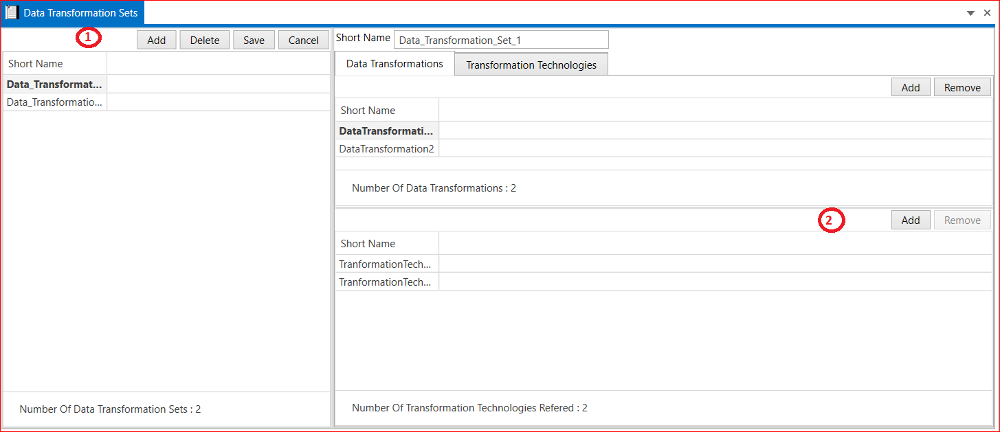

# 9.1 Data Transformation Set  

1. Add  Data Transformation Set → Short Name→ Save.

2. Add Transformation Technologies  → Short Name →Save.

3. Select Technology Type ( SOMEIP and ENDTOEND) →
Technology Type (SOMEIP)→ Version → Has Internal State (True or False) →Need Original Data (True or False)→ Transformer Class (CUSTOM, SAFETY , SECURITY and SERIALIZER) →Header Length → In Place (True or False)→ Alignments→ Byte Order → Interface Version .

4. Technology Type (ENDTOEND) →  Version → Has Internal State (True or False) → Need Original Data (True or False) → Transformer Class (CUSTOM, SAFETY , SECURITY and SERIALIZER) → Header Length→ In Place (True or False)  → Counter Offset→ CRC Offset → Data ID Mode (ALL16BIT, ALTERNATING8BIT, LOWER12BIT and LOWER8BIT)→Data Id Nibble Offset → Max Delta Counter → Max Error State Init →Max Error State Invalid →Max Error State valid → Max No New Or Repeated Data -> Min Ok State Init→  Min Ok State Invalid →  Min Ok State Valid → Offset → Profile Behavior (PRER42 and R42)→Profile Name → Sync Counter Init → Upper Header Bits To shift→ Window Size → Save Transformation Technologies.

5. Add Data Transformation → Short Name →Add Transformation Technologies →Save. 

<figure>

<figcaption>Fig. Data Transformation Set</figcaption>
</figure>

