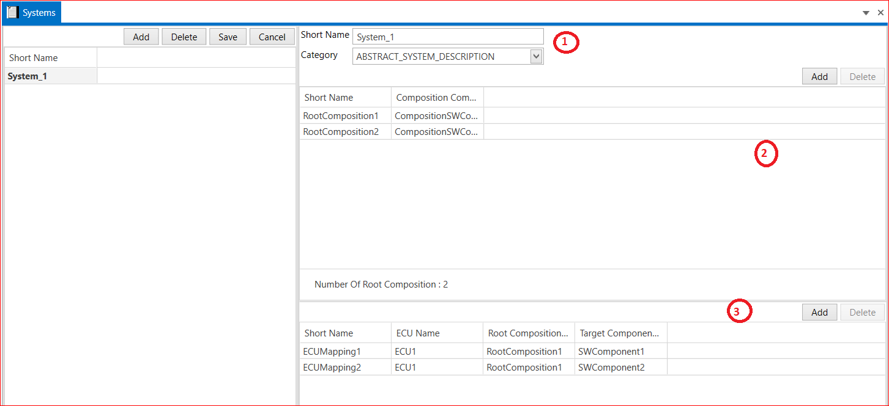

# 9.4 System 

1. Add System → Short Name → Category(SYSTEM_CONSTRAINTS, SYSTEM_DESCRIPTION,SYSTEM_EXTRACT,ECU_EXTRACT, ABSTRACT_SYSTEM_DESCRIPTION,ECU_SYSTEM_DESCRIPTION, SW_CLUSTER_SYSTEM_DESCRIPTION, RPT_SYSTEM)→ Save.

2. Add Number of Root Composition → Short Name → Select Composition SW Component Type → Save.

3. Add Number of SWC To ECU Mappings → Select ECU → Select Root Component → Select Application SW Component → Target Component Name → Save it.

<figure>

<figcaption>Fig. System </figcaption>
</figure>

